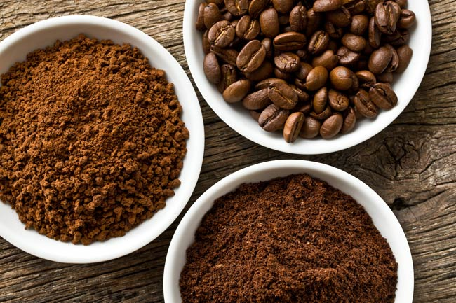

# Coffee Sales Analysis Project

## Introduction
This project demonstrates the use of Excel to analyze and visualize a dataset of coffee shop sales. It involves data cleaning, formatting, and the creation of calculated columns, pivot tables, and charts to develop a comprehensive dashboard. The goal is to showcase skills in data manipulation, analysis, and visualization.

## Problem Statement
The primary objectives of this project are:
1. 📈 **Overall Sales Trends**: What are the overall sales trends throughout the year?
2. ☕ **Popular Coffee Types and Roasts**: Which coffee types and roast types are the most popular?
3. 🌍 **Regional Preferences**: How do customer preferences vary by region?
4. 🎟️ **Loyalty Program Impact**: What is the impact of the loyalty program on customer spending?
5. 📦 **Package Size Relationship**: What is the relationship between package size and sales volume?
6. 🔍 **Root Cause Analysis**: Why do certain regions prefer specific roast types?

## Skills Demonstrated
- Data Cleaning and Preparation 🧹
- Advanced Excel Functions (e.g., XLOOKUP, INDEX MATCH) 🔍
- Pivot Tables and Charts 📊
- Data Formatting and Validation 📝
- Descriptive, Trend, and Comparative Analysis 📉
- Customer Segmentation and Root Cause Analysis 🔎

## Data Sourcing
The data for this analysis was sourced from a coffee shop sales dataset, which includes:

- **Raw Sales Data**: The original dataset includes comprehensive sales records, detailing information such as order dates, coffee types, roast types, sizes, unit prices, and quantities sold.
  
- **Processed Data**: The cleaned and processed dataset used in the analysis.

## Data Transformation
The data was cleaned and transformed to ensure accuracy and consistency:
- **Data Lookup and Matching**: Used `XLOOKUP` and `INDEX MATCH` to populate missing customer and product information.
- **Sales Calculation**: Created a new column for Sales, calculated as `Unit Price * Quantity`.
- **Column Expansion**: Expanded Coffee Type and Roast Type names using `IF` functions.
- **Date and Size Formatting**: Formatted dates and sizes appropriately, and applied currency formatting.
- **Duplicate Check**: Confirmed no duplicates using the `Remove Duplicates` feature.
- **Table Creation**: Converted data range to a table for better handling.

## Modelling
Key analyses included:
- **Sales Calculation**: Created a column for total sales to analyze trends and patterns.
- **Data Formatting and Expansion**: Used Excel functions like XLOOKUP and INDEX MATCH to format and enrich data, preparing it for detailed analysis.

## Analysis & Visualization
Key models and techniques were applied to analyze and interpret sales data:
- **Sales Trends**:
  - **Monthly Trends**: Sales peaked in the first half of the year with notable fluctuations.
  - **Outliers**: Identified significant sales spikes and drops, particularly for Arabica and Liberica.

- **Top-Selling Coffee Types**:
  - **Most Popular**: Excelsa was the most popular coffee type, with notable spikes for Arabica and Liberica.

- **Roast Type Preferences by Region**:
  - **UK**: Medium roast is most popular, followed by Light roast.
  - **Ireland**: Dark roast leads, followed by Light roast.
  - **US**: Light roast leads in sales, followed by Medium and Dark roasts.

- **Loyalty Program Impact**:
  - Loyalty card holders spent about 10% more on average compared to non-holders.

- **Size Preferences**:
  - Larger package sizes generally resulted in higher sales.

## Conclusion and Recommendations

### Conclusion
- **Sales Trends**: Significant sales peaks in the first half of the year with notable outliers.
- **Top Coffee Types**: Excelsa is the most popular, with Arabica and Liberica showing significant spikes.
- **Regional Preferences**: Preferences vary by region, with specific roast types leading in different countries.
- **Loyalty Program**: Effective in increasing customer spending by 10%.
- **Package Size**: Larger sizes correlate with higher sales.

### Recommendations
1. **Seasonal Promotions** 🌟: Target promotions during the first half of the year to maximize revenue and investigate sales outliers.
2. **Regional Marketing Strategies** 🎯: Tailor campaigns to regional preferences, emphasizing Medium and Light roasts in the UK and Dark roasts in Ireland.
3. **Loyalty Program Enhancement** 💳: Further enhance the loyalty program to increase customer spend.
4. **Bulk Purchase Incentives** 📦: Offer promotions for larger package sizes to boost sales.

### Further Investigation
1. **Sales Fluctuations** 🔍: Analyze causes behind significant sales spikes and drops for Arabica and Liberica.
2. **Regional Preferences** 🌍: Investigate cultural factors influencing roast type preferences to optimize product offerings.

## Data Access
- **[Original Data Set](raw_data.xlsx)**: The raw dataset used for analysis.
- **[`processed_data.xlsx`](coffee_sales_analysis.xlsx)**: The cleaned and processed dataset used in the analysis.

Feel free to explore the provided files for more details.

---

Thank you for exploring the Coffee Shop Sales Analysis Project. I hope you find the insights and visualizations helpful for understanding coffee sales trends and customer preferences.
